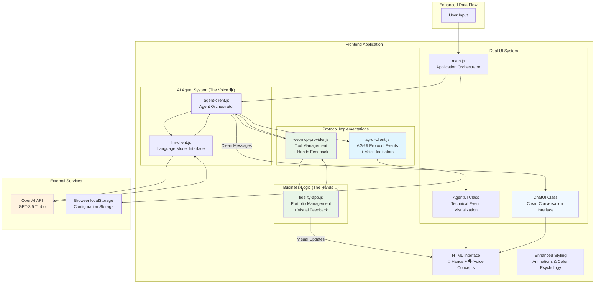
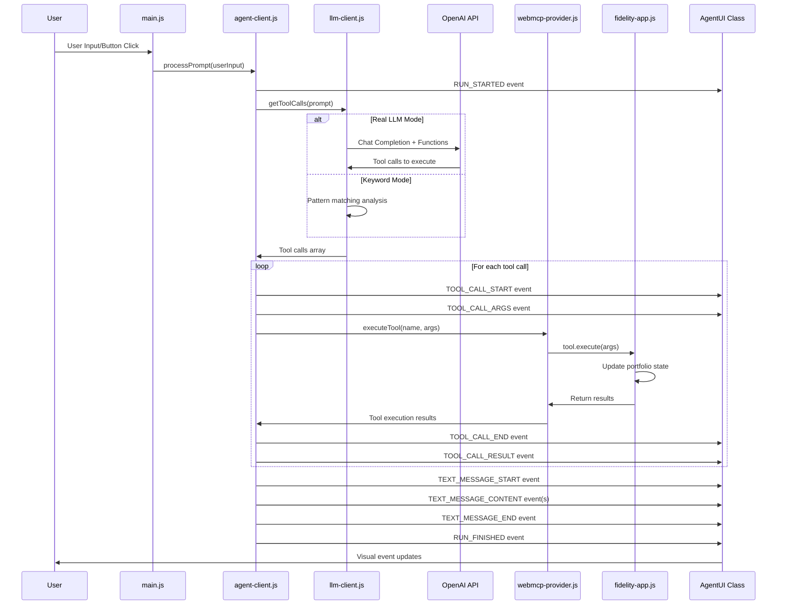
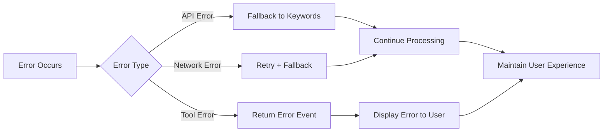

# 🏗️ Architecture Documentation

## Fidelity WebMCP + AG-UI Protocol POC Architecture

This document provides a comprehensive overview of the architecture, design patterns, and information flow in the Fidelity WebMCP + AG-UI Protocol proof-of-concept application. The POC serves as both a functional demonstration and an educational tool, using visual metaphors and animations to make the abstract concepts of "Hands" (WebMCP tool execution) and "Voice" (AG-UI communication transparency) manifest in the user interface.

## 📊 High-Level Architecture Diagram



## 🔧 Component Architecture

### Information Flow Pattern

The application follows a **unidirectional data flow** with **event-driven communication**:



## 📁 File Architecture & Responsibilities

### Frontend Layer

#### `index.html`
**Role**: Application Shell & Structure
- **Responsibility**: 
  - Defines the overall page layout and structure
  - Contains the Fidelity app container and Agent UI panels
  - Includes API configuration UI components
  - Provides example prompt buttons for user interaction
- **Key Elements**:
  - Split-panel layout (Fidelity app + Agent assistant)
  - API key configuration panel with security indicators
  - Chat interface with example prompts
  - Script loading order for dependencies

#### `css/styles.css`
**Role**: Visual Design & Conceptual Implementation
- **Responsibility**:
  - Defines visual appearance with "Hands vs Voice" color psychology
  - Implements comprehensive animation system for tool feedback
  - Provides conceptual visual framework throughout the interface
  - Includes accessibility and educational user experience design
- **Key Features**:
  - Hands/Voice color theming: Green for actions, Blue for communication
  - Animation keyframes: flash, pulse, slide, speaking effects
  - Conceptual headers with emoji and descriptive text
  - Interactive concept explainer with expandable educational content
  - Visual flow connectors demonstrating architectural relationships
  - DOM update highlighting with contextual animations
  - Professional financial styling enhanced with conceptual metaphors

### Application Orchestration Layer

#### `js/main.js`
**Role**: Application Orchestrator & Event Coordinator
- **Responsibility**:
  - Initializes all application components and dependencies
  - Manages user interactions and input handling
  - Coordinates communication between UI and agent systems
  - Handles API key configuration and persistence
  - Manages application state and lifecycle
- **Key Functions**:
  - Component initialization and dependency injection
  - User input processing and validation
  - API key management with localStorage persistence
  - Example prompt button handling
  - LLM mode switching and status updates

#### `js/fidelity-app.js`
**Role**: Business Logic & Portfolio Management (The "Hands")
- **Responsibility**:
  - Implements the core financial application functionality
  - Manages portfolio state and calculations with visual feedback
  - Provides WebMCP tool implementations with "hands at work" indicators
  - Handles portfolio rebalancing and projections with DOM animations
  - Maintains transaction history with visual update highlighting
- **Key Features**:
  - Portfolio allocation management (stocks, bonds, cash) with flash animations
  - Risk assessment and strategy implementation with visual confirmations
  - Retirement projection calculations with pulse effects on updates
  - WebMCP tool registration and execution with hands-themed overlays
  - Real-time UI updates enhanced with `renderWithAnimation()` method
  - Visual "hands at work" indicators during tool execution (⚖️, 📊, 📋)

### Agent System Layer

#### `js/agent-client.js`
**Role**: AI Agent Orchestrator & AG-UI Event Generator
- **Responsibility**:
  - Orchestrates the complete agent execution lifecycle
  - Generates compliant AG-UI protocol events
  - Manages tool execution sequences
  - Handles error scenarios and fallbacks
  - Provides intelligent response generation
- **Key Functions**:
  - AG-UI event stream generation with proper sequencing
  - Tool call orchestration and result handling
  - Error handling with graceful degradation
  - Response generation (both LLM and keyword modes)
  - Event timing and streaming simulation

#### `js/llm-client.js`
**Role**: Language Model Interface & Natural Language Processing
- **Responsibility**:
  - Abstracts language model interactions
  - Handles both OpenAI API integration and keyword fallback
  - Manages tool calling via OpenAI Functions API
  - Provides natural language understanding capabilities
  - Handles API error scenarios and fallbacks
- **Dual Mode Operation**:
  - **LLM Mode**: Real OpenAI GPT-3.5 integration with function calling
  - **Keyword Mode**: Pattern-based command recognition for demos
- **Key Features**:
  - OpenAI Chat Completions API integration
  - Automatic tool schema generation for OpenAI Functions
  - Intelligent prompt engineering for financial domain
  - Robust error handling and fallback mechanisms

### Protocol Implementation Layer

#### `js/ag-ui-client.js`
**Role**: AG-UI Protocol Implementation
- **Responsibility**:
  - Implements the official AG-UI Protocol event types and structures
  - Provides event classes following AG-UI specifications
  - Ensures protocol compliance and type safety
  - Serves as the foundation for agent-user interaction
- **Protocol Events Implemented**:
  - **Lifecycle**: `RUN_STARTED`, `RUN_FINISHED`, `RUN_ERROR`
  - **Text Messages**: `TEXT_MESSAGE_START`, `TEXT_MESSAGE_CONTENT`, `TEXT_MESSAGE_END`
  - **Tool Calls**: `TOOL_CALL_START`, `TOOL_CALL_ARGS`, `TOOL_CALL_END`, `TOOL_CALL_RESULT`
  - **Base Infrastructure**: `BaseEvent` with timestamps and metadata

#### `js/webmcp-provider.js`
**Role**: WebMCP Tool Management & Execution
- **Responsibility**:
  - Implements WebMCP (Web Model Context Protocol) concepts
  - Manages tool registration, discovery, and execution
  - Provides secure tool execution environment
  - Handles session management and tool lifecycle
- **Key Features**:
  - Dynamic tool registration and discovery
  - Secure tool execution with error handling
  - Session management for multi-step interactions
  - Tool metadata and capability exposure

### Visualization Layer

#### `AgentUI Class` (in main.js)
**Role**: Technical Event Visualization & Transparency (The "Voice")
- **Responsibility**:
  - Renders AG-UI protocol events in real-time with voice indicators
  - Provides technical transparency into agent decision-making
  - Manages event state tracking and visualization with voice metaphors
  - Implements color-coded event categorization with voice prefixes
- **Features**:
  - Real-time event streaming with voice activity indicators (🎤, 💬, 📢)
  - State tracking for active messages and tool calls
  - Voice-themed visual design emphasizing communication transparency
  - Automatic scrolling and event history management
  - Callback system to notify other UI components of completed messages

#### `ChatUI Class` (in main.js)
**Role**: Clean Conversation Interface (Human-AI Dialog)
- **Responsibility**:
  - Provides clean, chat-style conversation interface
  - Displays user messages and agent responses without technical noise
  - Maintains conversation history and context
  - Implements professional messaging UI patterns
- **Features**:
  - Dual-sided message bubbles (user vs agent)
  - Timestamp tracking and display
  - Message history persistence
  - Professional messaging aesthetics with avatars and gradients
  - Auto-scrolling conversation flow

#### Visual Conceptual Framework
**Role**: "Hands vs Voice" Educational Implementation
- **Hands (WebMCP) Visualization**:
  - Green-themed interface with hands emoji (🤲)
  - "Hands at work" overlays during tool execution (⚖️, 📊, 📋)
  - Action-focused animations and visual feedback
  - DOM update highlighting with flash and pulse effects
- **Voice (AG-UI) Visualization**:
  - Blue-themed interface with voice emoji (🗣️)
  - Voice activity indicators and speaking animations
  - Dual transparency: technical events + clean conversation
  - Real-time communication metaphors throughout the interface
- **Educational Components**:
  - Interactive concept explainer with expandable content
  - Visual flow connector showing "Hands Execute → Voice Reports"
  - Contextual help text reinforcing architectural principles

## 🔄 Data Flow Architecture

### Request Processing Flow

1. **User Input Capture**
   ```
   User Action → main.js → Input Validation → Agent Processing
   ```

2. **Agent Processing Pipeline**
   ```
   AgentClient → LLMClient → [OpenAI API | Keyword Matching] → Tool Selection
   ```

3. **Tool Execution Flow**
   ```
   WebMCP Provider → Tool Discovery → Fidelity App Execution → Result Return
   ```

4. **Event Generation & Visualization**
   ```
   AG-UI Events → AgentUI Rendering → Real-time User Feedback
   ```

### State Management

The application uses **multiple state management patterns**:

- **Component State**: Each component manages its own internal state
- **Browser Storage**: API keys and configuration persistence
- **Event-Driven State**: AG-UI events drive UI state changes
- **WebMCP State**: Tool and session state management

### Error Handling Strategy



## 🔧 Design Patterns & Principles

### Architectural Patterns

1. **Event-Driven Architecture**
   - All agent actions generate AG-UI protocol events
   - Loose coupling between components via events
   - Real-time user feedback through event streams

2. **Strategy Pattern**
   - LLM vs. Keyword processing strategies
   - Different portfolio management strategies
   - Configurable behavior without code changes

3. **Provider Pattern**
   - WebMCP provider for tool management
   - Centralized tool registration and discovery
   - Abstracted tool execution interface

4. **Observer Pattern**
   - AgentUI observes and visualizes AG-UI events
   - Real-time updates without tight coupling
   - Extensible visualization system

### Visual Enhancement Framework

#### Animation System
The POC implements a comprehensive CSS animation system that provides visual feedback for various agent actions:

1. **Flash Animation** (`@keyframes flash`)
   - Triggers during DOM updates to highlight changes
   - Green accent color reinforcing "Hands" action theme
   - Used for portfolio value updates and tool executions

2. **Pulse Animation** (`@keyframes pulse`)  
   - Subtle breathing effect for continuous actions
   - Indicates ongoing processes without being distracting
   - Applied to elements during calculation phases

3. **Slide Animation** (`@keyframes slideDown`)
   - Smooth reveal effect for new content
   - Professional entrance for updated sections
   - Maintains visual hierarchy during updates

4. **Speaking Animation** (`@keyframes speaking`)
   - Voice-themed effect for AG-UI communication events
   - Reinforces "Voice" concept with communication metaphors
   - Applied to voice indicators during agent responses

#### Educational Components
The interface includes several educational elements that make abstract architectural concepts concrete:

1. **Concept Headers**
   - Visual separation of "Hands" (WebMCP) and "Voice" (AG-UI) areas
   - Emoji-based iconography with descriptive text
   - Color psychology: Green for action, Blue for communication

2. **Interactive Explainer**
   - Expandable educational content explaining the dual-protocol architecture
   - Real-time examples of how Hands and Voice work together
   - Professional presentation suitable for client demonstrations

3. **Visual Flow Indicators**
   - Connector elements showing "Hands Execute → Voice Reports" relationship
   - Reinforces architectural understanding through visual metaphors
   - Helps users understand the complementary nature of the two protocols

### Protocol Compliance

- **AG-UI Protocol**: Strict adherence to official event specifications with voice-themed enhancements
- **WebMCP Concepts**: Tool-based interaction patterns with hands-themed visual feedback
- **OpenAI Functions**: Proper function calling implementation with educational transparency
- **Error Handling**: Graceful degradation and fallback mechanisms with user-friendly messaging

## 🚀 Scalability Considerations

### Current Architecture Benefits

1. **Modular Design**: Each file has clear responsibilities
2. **Protocol Standards**: Based on established, open protocols
3. **Fallback Mechanisms**: Works with or without external APIs
4. **Extensible**: Easy to add new tools and event types

### Production Scaling Paths

1. **Backend Integration**: Move LLM calls to secure backend
2. **State Management**: Implement proper state stores (Redux, Zustand)
3. **Real-time Transport**: WebSockets for production event streaming
4. **Microservices**: Separate tool providers and agent services
5. **Security**: Authentication, authorization, and audit logging

## 📋 Integration Points

### External Dependencies

- **OpenAI API**: Real language model integration
- **Browser APIs**: localStorage, fetch, DOM manipulation
- **AG-UI Protocol**: Event structure and sequencing standards

### Internal Dependencies

```
main.js
├── fidelity-app.js (portfolio management)
├── agent-client.js (agent orchestration)
│   ├── llm-client.js (language processing)
│   └── ag-ui-client.js (protocol events)
├── webmcp-provider.js (tool management)
└── AgentUI class (event visualization)
```

This architecture demonstrates a production-ready approach to building transparent, interactive AI systems that comply with emerging protocols while maintaining security, scalability, and user experience standards.